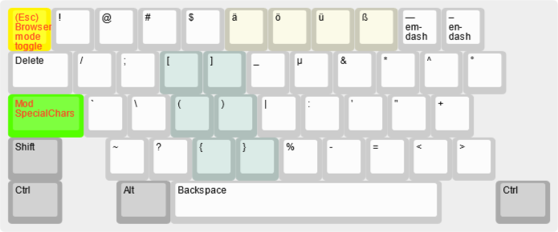

# KeyboardRemap

My custom keyboard remap, in two versions:

 1) The main version uses a combination of [Capsicain](https://github.com/cajhin/capsicain) and [AutoHotkey v1](https://www.autohotkey.com/), which is more reliable.
 2) The old version is AutoHotkey-only; it is  not maintained, but currently still mostly up-to-date with the main version.

## Layout diagrams

### Base layer

This layer is active by default.

- The **Macro key** is mapped to F13 — it is intended for use in other apps as a general purpose macro key.
- The **reddit** key sends `<End> site:reddit.com<Enter>` as a key sequence. I use it when searching in a browser, as I often want to narrow down the results to reddit posts.
- The **!g ddg** key sends `/<End> !g<Enter>` as a key sequence. When viewing DuckDuckGo search results, this repeats the same search query in Google.
- The **Mod SpecialChars** key switches to the [SpecialChars layer](#specialchars-layer) while held (see below).
- The **Mod Nav** keys (there are two, both do the same thing) switch to the [Navigation layer](#navigation-layer) while held (see below).

### Accents

I use the following `Shift-?` an `Ctrl-Shift-?` key combinations to type most of the Czech accents and em-dash + en-dash.

### Navigation layer

This layer is active momentarily while one of the **Mod Nav** keys (`ISO \` or `;`) is held. I use this to navigate in text while working in a text editor, without leaving the home row.

### SpecialChars layers

This layer is active momentarily while the **Mod SpecialChars** key (`CapsLock`) is held. This layer contains all special characters I use, so that I can type them without leaving moving my hand around to the edges of the keyboard.

### Browser mode

This layer is activated using one of the `Browser mode toggle` and `Browser mode on` keys in the other layers. I use it when browsing the web or reading and navigating through text files.

The provided `capsicain.ahk` AutoHotkey script renders a small GUI indicator in the lower right corner of my screen, which changes color when browser mode is active. To hide this indicator, press `Ctrl-PrintScreen`. To show it again, press `Shift-PrintScreen`.

## Notable features

This is just an overview, for the current exact bindings, read the source code. :)

- **Browser mode:** separate "browser mode" config that allows me to operate a browser using one hand by mapping letters to browser navigation keys — `f` = ArrowDown, `d` = ArrowUp, `e` = PgUp, `s` = PgDown, `w` = ArrowLeft, `r` = ArrowRight, `t` = Ctrl-Shift-Tab,...
  - Current mode is indicated using a small GUI indicator in the screen corner
  - To toggle, use `'`, `CapsLock-Escape`; to activate from normal mode, `;-q` works; to deactivate, you may also use `1` 

- **CapsLock for special characters:** separate layer that lets me type all commonly used special chars using the middle 3 keyboard rows - `CapsLock-d` = `(`, `CapsLock-j` = `'`,...

 - **`Shift-<num>` for Czech accents** (and `Ctrl-Shift-<num>` for uppercase)
 - **`;` and `L\` as a layer for navigation:** both of those are very nicely placed keys, which are almost asking to be used for macros :) ; I'm using them for text navigation, e.g. arrows, home/end,...
	 - a bit unusually, I'm using j=down, k=up, i=left, l=right; this lets me keep my fingers on the home row when scrolling, and matches `vim` layout more
	 - for the left hand, the layout is similar, but for Home/End/PgUp/PgDn on `esdf` (I'm using `esdf` even when gaming, as it's imo more natural than `wsad`)
 - **Window switching using hotkeys:** `Win-f` = Firefox, `Win-c` = Spotify,...; if the window exists, it is focused, otherwise the app is started (you may need to adjust the exe paths for your system)
 - Virtual desktop switching using `[` and `]`
 - `RShift` = minimize current window, `;-RShift` = close current window

## Usage

Apologies, this is not very streamlined. If you want to try the config and something doesn't work, open an issue and I'll try to improve this a bit. Afaik, I'm currently the only user, so I don't have much motivation to polish the setup. :)

First, start Capsicain by moving/symlinking the `capsicain.ini` from this repo to the Capsicain installation dir and then running `capsicain.exe`.

Second, start the AutoHotkey part by running `./ahk/compiled/capsicain.ahk` directly using AutoHotkey. Alternatively, install [`js2ahk`](https://github.com/MatejKafka/js2ahk) (mostly abandoned, but I still use it), adjust the path in `./ahk/ahkCapsicain.cmd` and then run it — it compiles the `capsicain.ahk.js` file and then runs the resulting `capsicain.ahk` file.

